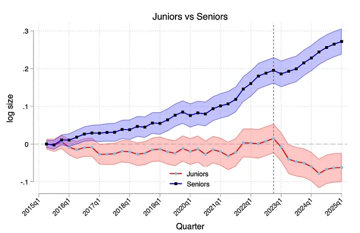
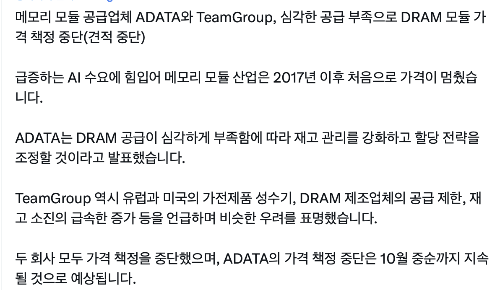
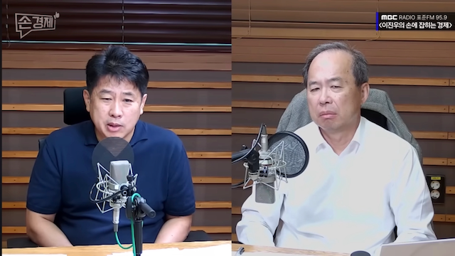
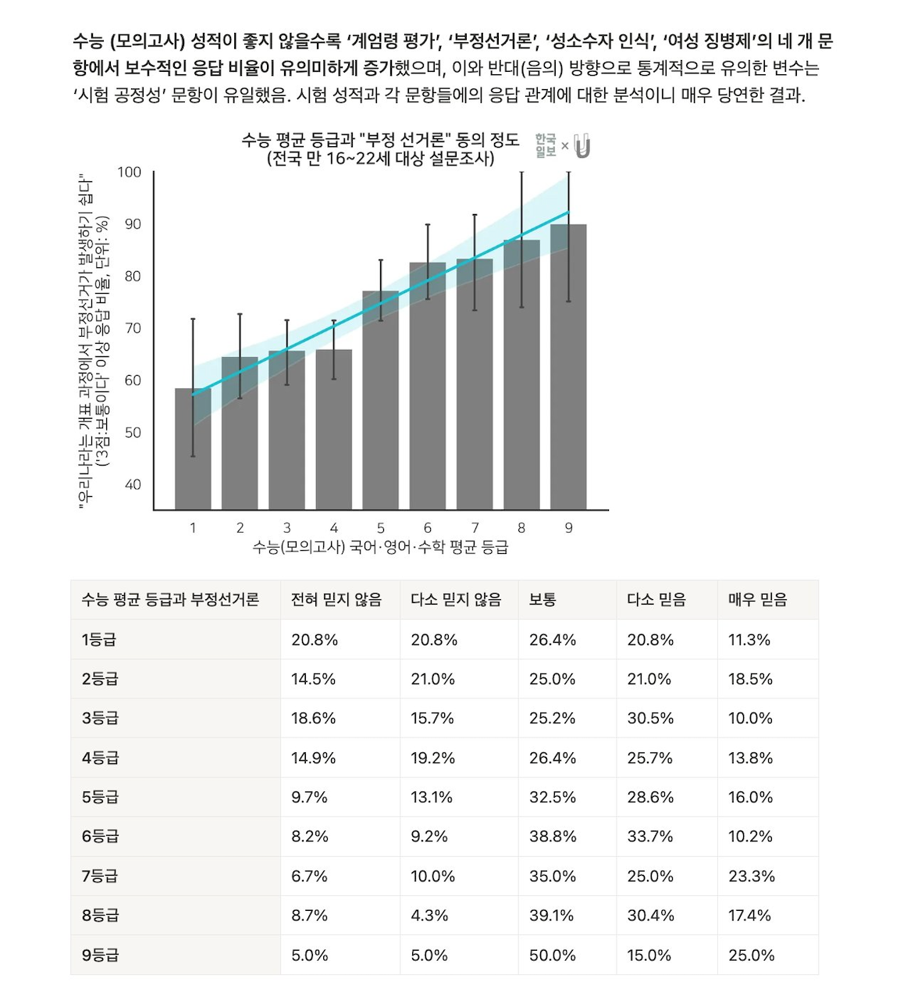

+++
date = '2025-10-10T15:00:00+09:00'
title = '251010 - SNS 소비 결과'
tags = ['SNS 소비', 'AI', '시장 동향']
+++

최근 SNS에서 눈에 띈 다섯 가지 콘텐츠를 정리했습니다. 링크를 따라가며 떠오른 생각과 주변에서 들은 이야기를 함께 기록해 둡니다.

### AI 구독권 vs. 신입 채용의 계산법

[Generative AI as Seniority-Biased Technological Change (2025.09.08)](https://www.facebook.com/share/p/1BxiZZqJi9/?mibextid=wwXIfr)

"AI 때문에 신입을 안 뽑는다"는 말이 과장이 아니라는 연구 결과가 나왔습니다. 지인이 다니는 회사에서는 신입을 추가로 채용하는 대신 직원 10명에게 `Claude Code` 월 100달러 구독을 붙여 주었다고 합니다. 모두가 10%씩 생산성이 오른다면, 전체로는 한 명의 인건비를 대체하는 셈이라는 계산입니다. 사람을 뽑으면 연봉 외에도 온보딩, 복리후생, 분위기 관리까지 챙겨야 한다는 점을 생각하면 경영진 입장에서는 충분히 합리적인 선택처럼 보입니다. 다만 AI가 놓치는 영역을 누가 메울 것인지, 그리고 조직의 학습 곡선을 어떻게 설계할 것인지가 다음 숙제로 남습니다.

### DRAM 메모리 부족

[DRAM 모듈 업체의 가격책정 중단](https://x.com/rwang07/status/1975790359763697966?s=46&t=SyViUmDzvRAUfiid_TT4nQ)

데이터센터를 짓든, 로컬 LLM 서빙 장비를 꾸리든 메모리는 끝없이 필요합니다. GPU마다 탑재해야 하는 메모리 용량이 커지고 있지만, 실제로는 CPU 메인보드에 붙는 시스템 메모리도 그보다 더 요구된다는 걸 자주 잊곤 합니다. GPU 공급망이 다양해져도 결국 모든 시스템에는 DRAM이 들어가야 하니 하이닉스와 삼성전자의 실적 기대가 계속 높아지는 게 자연스럽습니다. 요즘 주가가 오른 상태지만, 메모리가 필요한 워크로드는 초입이라는 생각이 듭니다.

### 김정호 교수님의 AI 반도체 전망

[[손경제 추석특집 특강] AI 시대, 대한민국 교육의 미래 - 김정호 교수](https://youtu.be/BOTu0wG3nrk?si=C6phUK_I8hd7bQBX)

김정호 교수님은 업계에서도 트랜드를 잘 잡고 이끄시던 분이라서 AI 관련된 이야기에도 늘 귀 기울여 듣게 됩니다. 작년부터 메모리의 중요성을 강조했는데, 지금도 AI에서의 메모리의 중요성은 늘어 갈 것이란 메시지를 주고 계십니다. 또한 AI 시대에 어떤 역량을 키울지, 교육이 무엇을 준비해야 할지 생각해 볼 만한 강연입니다.

### 지수적으로 성장할 AI를 상정하면

[EP 71. 시끌벅적한 전환의 시기, 쏟아지는 AI 뉴스들 (25.09.26~25.10.04)](https://www.youtube.com/watch?v=A98IRtQCgkI&t=415s)

노정석님의 영상은 AI 이슈를 한눈에 정리해 줍니다. 이번 회차에서는 샘 올트먼이 언급한 `SteamRole` 이야기가 짧지만 오래 남았습니다. 그는 2024년에 현재 AI 모델의 한계를 메우는 서비스는 금방 진부해질 것이라는 경고를 했습니다. 제품을 기획할 때는 다음 단계의 AI 수준을 미리 상정해야 한다는 뜻이겠죠. 지난 2년간 AI 모델의 성능은 지수적으로 발전해 오고 있고, 프론티어의 AI 모델과 서비스가 출시 될 때마다 많은 스타트업의 서비스들이 필요가 없어졌습니다.

### 10대의 수능 성적과 보수화

[[한국일보×언더스코어] 10대 청소년들에게서도 남녀 간 정치 성향 차이가 강력하게 나타날까?](https://minvv23.notion.site/10-2203236d0cb1802e8ee0c4d10345e8fc)

조사를 보면 수능 등급이 낮을수록 "윤석열의 계엄이 바람직하다"거나 "부정선거가 일어날 수 있다"는 주장에 동의하는 비율이 높았습니다. 정보의 질과 양이 갈라지면 사회 인식의 간극도 그만큼 벌어진다는 뜻일까요. 더 많은 대화와 미디어 리터러시 교육이 필요한 부분이 아닐까 생각하게 됩니다.
