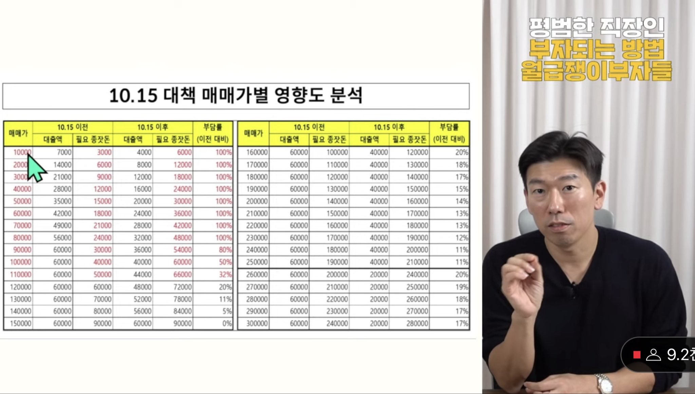

+++
date = '2025-10-18T15:00:00+08:00'
title = '251018 - SNS 소비 기록'
tags = ['SNS 소비', '부동산 정책', 'AI', '칩 설계']
categories = ['SNS 소비']

[[resources]]
  name = 'featured-image'
  src = 'IMG_0.png'
[[resources]]
  name = 'featured-image-preview'
  src = 'IMG_0.png'
+++

이번 주 SNS 소비 중에서 기억에 남는걸 정리 합니다.

### OpenAI, 자체 칩 설계와 LLM 적용 사례 공개
[OpenAI @openai](https://x.com/openai/status/1977794196955374000?s=46&t=SyViUmDzvRAUfiid_TT4nQ)

LLM 선두 그룹이 자체 칩을 만든다는 소문은 계속 돌았지만, OpenAI가 브로드컴과 Chip을 만들고 있다고 공개 했습니다. 공급망을 붙잡고 훈련 비용을 줄이려는 움직임으로 보이는데, 더 눈에 띈 건 그렉 브록맨의 코멘트. “We’ve gotten some amazing lift out of applying our models to chip design”이라면서 이미 자사 모델로 설계를 돕고 있다고 했습니다. EDA 워크플로에 GPT를 넣어 결과를 보고 있다는 거죠. 이 흐름이 본격화되면 엔비디아, 브로드컴 같은 팹리스뿐 아니라 시놉시스, 케이던스 같은 EDA 소프트웨어 회사들까지 판이 빨리 바뀔 수도 있겠다는 생각이 듭니다. 한마디로 모델 경쟁력이 하드웨어 최적화까지 확장되는 그림이 현실이 되는 중입니다.

### 부동산 10.15 대책, 갈아타기 수요는 어디로?
[쇼킹 부동산 - 10.15 부동산대책 총정리](https://youtu.be/7_lX1b7zkvA?si=sQclNVOy8CyE2aOT)

부동산은 두 채널을 주로 봅니다. 쇼킹 부동산, 월급쟁이 부자들(너나위). 10월 15일 발표된 대책도 두 채널 중심으로 봤습니다. 월급쟁이 부자들의 너나위님은 `11억 이하 아파트에 LTV 40% 적용`이라는 문장이 결국 사회 초년생들의 매수 가능 금액을 확 줄인다고 하더라구요. 제 생각에는 이 구간에 있던 갈아타기 수요도 줄지 않을까 싶습니다. 저 가격 구간에서 집을 사기 어려우면 11억 이하에서 집을 매도하고 다음 가격 구간의 집을 사기도 어려워져서 갈아타기 사슬 전체가 영향을 받지 않을까 싶네요. 반면 쇼킹 부동산은 11억 이하는 “맹탕 정책”이라고 표현 했네요, 두 채널 모두 이번 정책이 11억~15억 구간에서 제한적일 거라고 봤습니다. 두 채널이 강조한 공통분모는 공급 부족. 정책 강도가 아무리 세도 새 물량이 안 나오면 조정이 길게 이어지기 힘들다는 이야기가 계속 나옵니다.

