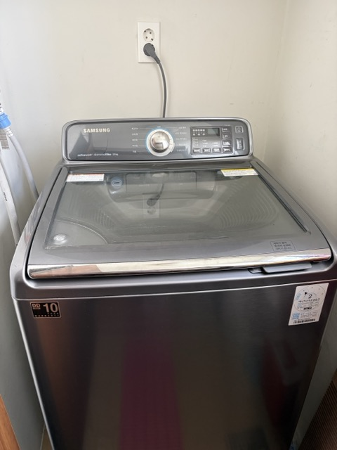
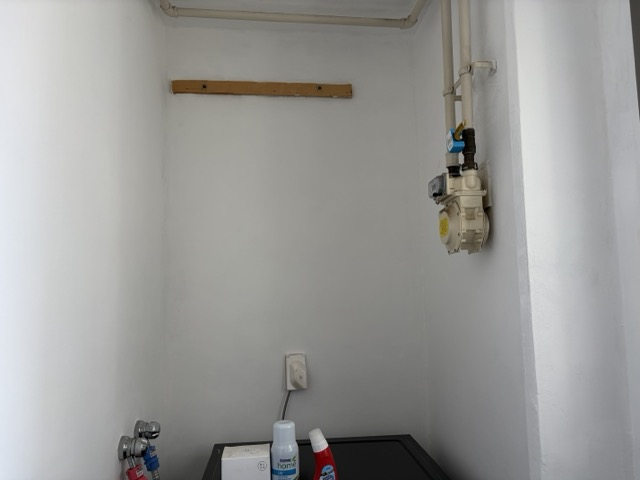
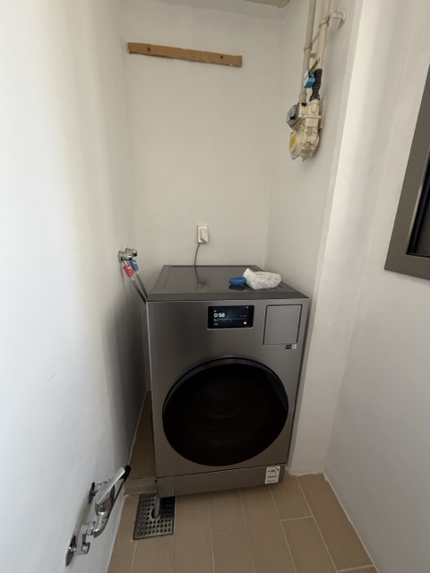
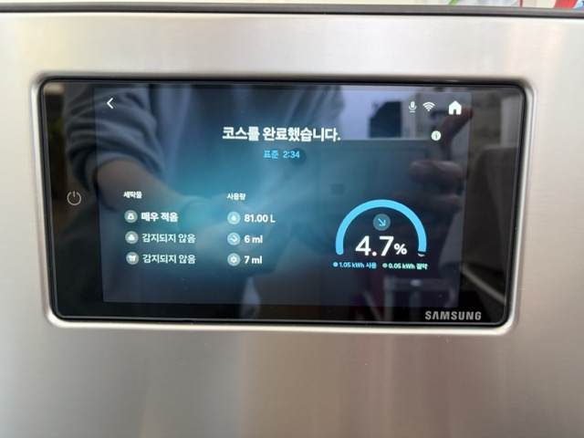

+++
title = '2026년형 삼성 BESPOKE AI 콤보 WD90H25AHT 구매·개봉기'
date = '2026-05-10T10:00:00+09:00'
draft = false
tags = ['삼성', 'BESPOKE', '비스포크', 'AI 콤보', 'WD90H25AHT', '2026년형', '세탁기', '가전', '구매기', '개봉기']
categories = ['Life']
description = '10년 쓴 통돌이 + 거실 9kg 건조기에서 삼성 BESPOKE AI 콤보(WD90H25AHT)로 — 워시타워 설치 불가 사연부터 모델 선정, 개봉/설치, 첫 사용 후기까지'

[[resources]]
  name = 'featured-image'
  src = 'IMG_2410_세탁완료안내.jpeg'

[[resources]]
  name = 'featured-image-preview'
  src = 'IMG_2410_세탁완료안내.jpeg'
+++

# 기존 구성 — 10년 쓴 통돌이 + 거실의 9kg 건조기

이전 집에서는 **삼성 통돌이 19kg** 세탁기를 10년 가까이 써오고 있었어요.

큰 고장 없이 잘 돌긴 했지만 까만 세탁조 찌꺼기가 조금씩 나오고 있었고 세탁기 돌아 갈 때 끽~ 끽~ 하는 소리도 나고 있었어요. 그리고 건조기는 따로 쓰고 있었는데, 세탁실 공간이 부족해서 **9kg 건조기를 거실에 두고 쓰고 있었어요**. 돌릴 때마다 거실 전체가 시끄러워지고 티비 볼 때도 불편해서, 이사하면 **꼭 건조기를 세탁실로 들여넣겠다**고 생각하고 있었죠.

그래서 이사와 함께 세탁기는 버리고 건조기는 당근 하면서 세탁기 구매를 알아 봤죠.

# 처음 선택은 LG 워시타워였다

가장 먼저 잡은 건 **LG 워시타워 W21GEAM**(세탁 24kg / 건조 21kg)이었어요. 쿠폰·카드 할인을 끼니까 270만원대로 가격이 잘 나왔고, 세탁기 위에 건조기가 올라간 형태라 좁은 세탁실에 한 줄로 세워 끝낼 수 있는 구조였습니다. 19kg 통돌이 + 거실 9kg 건조기 → 세탁실 안에 24kg + 21kg 한 세트로 묶이는 그림이라 동선·소음 둘 다 해결되는 셈이었죠.

세탁기 + 건조기가 하나의 세탁통으로 되는 콤보를 생각하기도 했었는데 여러 리뷰를 보다 보니, 세탁기와 건조기를 병렬로 한번에 돌리는게 좋겠다는 생각이 들었어요. 명절 지내고 올 때 처럼 한번에 돌릴 때면 아무래도 둘 다 돌리면 시간이 줄 수 있으니까요. 또 이불 같은거는 건조에 오래 걸리는데 좀 답답 할 것도 같고, 그래서 두개짜리로 사기로 결정 했습니다.

2개 짜리로 결정하고 나니, 귀곰님 유투브에서도 그렇고 LG가 좋아 보이더라구요. 그래서 LG 워시타워로 결정하고 최고급 모델 부터 보급형 모델까지 쭉~ 살펴 보고 내린 결론은 W21GEAM 였죠.

그런데,

문제는 이사 후 세탁실 공간이었습니다.

사진을 보면 **오른쪽 벽에 도시가스 계량기와 배관**이 자리 잡고 있고, 왼쪽 아래에는 급수용 수도꼭지가 있어요. 가로 폭이 그만큼 깎이는 구조였습니다.

구매 하면 배송 하기 전에 전화가 옵니다. 그때 혹시나 해서 워시타워를 들여놓을 수 있을지 문의해봤는데, 측정값을 받아 본 설치 기사님이 **"가로 길이가 안 나와서 설치 불가"**라고 답을 주셨어요. 결국 워시타워는 포기. "세탁기 + 건조기를 한 대로 합쳐서 세탁실에 놓자"는 방향으로 넘어가, **콤보** 라인업을 다시 보기 시작했습니다.

# 모델 선정 — LG vs 삼성

콤보로 가닥을 잡은 뒤 검색해 보니 콤보쪽은 삼성이 LG 보다 좋아 보였어요. 세탁은 LG가 우위 같긴 했지만 건조 능력이 삼성이 좋았어요. 그래서 콤보는 삼성으로 결정.

삼성 내에서도 여러 모델이 있는데, 하아 많은 고민 끝에 그냥 최고급 모델로 선택 했습니다. 제가 원래 최고급 모델 사는 사람이 아닌데, AI 콤보는 최고급 모델로 갔습니다. ㅜㅜ

모델명 : **WD90H25AHT** 

삼성의 급나누기는 참 하아 ㅋ, 최고급 모델을 결정한 이유는,

1. 20kg 건조 용량
2. 오픈 도어 +

두가지에요.

25년도 모델에서 건조 기능을 보완해서 나온 것도 선택 하면 좋을 것 같았고, 저희는 맞벌이를 하고 있으니 문 자동열림은 좀 있었으면 좋겠는데 이게 최고급 모델에서 밖에 없네요. 사실 자동 문열림이 한단계 아래 모델에 있었으면 그거 선택할 수도 있었을 것 같은데 없어서 그냥 최고급 모델로 갔습니다. 

# 사전 점검

LG, 삼성 모두 세탁기 설치가 가능한지 사전 점검이 가능해요. 저희는 스토어에서 신청 했어요. 신청 하면 오셔서 실제 설치가 가능한지 확인해 주십니다. 사실 저희가 턱이 있어서 깊이 길이가 살짝 모자랄 수 있어서 문의 했더니 오셔서 설치 가능을 확인해 주셨습니다.

# 개봉 / 설치 첫인상

배송 후 삼성 설치 기사님이 방문해서 급수·배수 연결까지 한 번에 마무리해 주셨어요.

설치 직후의 모습이에요. 앞에서 본 그 세탁실 공간(워시타워가 들어가지 못했던 그 자리예요) 2단으로 쌓지 않아도 돼서 도시가스 계량기랑 상관 없이 설치가 가능하구요. 세탁기가 이렇게 깔끔하게 들어갔습니다. 저희는 상부장을 안달긴 했는데 상부장도 설치 가능할 것 같구요.

첫인상에서 가장 눈에 띈 건 두 가지였어요.

1. **디자인** — BESPOKE 라인답게 외관이 깔끔합니다. 세탁실을 흰색으로 도색 했었기 때문에 흰색을 살 걸~ 이라고 좀 후회 했네요.
2. **AI / 디스플레이 인터페이스** — 터치 패널 UI가 직관적이고, AI 기반 코스 추천이나 상태 표시 방식이 좋았어요. 사실 다이얼 방식이나 전체 메뉴가 다 보이는 방식도 괜찮다고 생각하는데 휴대폰에 익숙해서 그런지 좋더라구요.

설치 기사님이 처음에는 고무 냄새가 날 수 있다고 건조 한번 돌리라고 해서 건조 한타임 돌렸습니다. 진짜 고무 냄새가 좀 나더라구요. 그리고 식히고 세탁 돌렸는데, 그 뒤로는 괜찮은 것 같아요.

# 자동 세제함

아래쪽을 열면 세제함이 2개가 있어요. 2개에 한쪽은 세제, 한쪽은 섬유유연제를 넣었구요. 섬유유연제 대신에 중성세제등으로 설정할 수도 있는 것 같았어요. 저희는 그냥 세제/섬유유연제 넣었습니다. 맞벌이라 뭘 나눠서 빨고 그러지 않거든요. 유투브 보면 흰색 옷, 검은색 옷 따로 빨고 그러는 것도 봤지만 맞벌이라 그런지 그런것도 귀찮습니다. ㅎ

# 간단하게 써본 느낌

세탁기가 없어서 밀린 빨래를 했습니다. 우선 수건과 가벼운 이불 하나를 넣고 표준으로 돌렸구요. 시간은 건조까지 2시간 20분 뜨더라구요. 오? 생각보다 빠른데? 5월의 좋은날이라 그런가? 암튼 세탁도 잘 되고 건조도 잘 되었어요. 예전에 세탁 다 되면 건조기로 옮기고 그래야 했는데 안하니까 편하긴 하더라구요. 세제도 안 넣고, 건조기로도 안 옮기고, 다 되면 문열려 있고. 새삼 편하네요.

세탁이 끝나면 이런 식으로 **코스/세탁물/사용량을 한 화면에 정리**해서 보여줘요. 이거도 좋은 것 같아요. LCD 큰게 무슨 소용이지 했는데 확실히 괜찮은 느낌? 

# 좋아요

뭐, 10년된 통돌이 쓰다가 바꾸었는데 뭔들 안 좋을까 싶지만 ㅋ 좋네요. 아까도 이야기 했듯이 세제, 섬유유연제 안넣고, 빨래 넣고, 돌리면 되고, 큼직한 화면의 터치 스크린 UI 도 나름 맘에 들구요. 세탁 끝나고 건조로 옮기지 않아서 편하고, 다 되면 문도 열려서 좋고. 물론 처음이라 그럴수도 있어요. 빨래감 밀려 있을 때 건조 한참 걸리면 속터질지 ㅎ 건조가 생각보다 잘 안되서, 세탁기/건조기 통이 각각 있는 모델이 정답이었을지는 모르지만 지금 생각은 나름 괜찮다. 이제 건조할 옷들은 출근전에 예약 걸어 놓고, 퇴근해서 정리만 하면 되겠구나 라는 생각? 물론 저희는 건조기 안돌리는 빨래도 많아서 아쉽긴 하지만 ㅜㅜ. 암튼 느낌이 나쁘진 않네요.

좀 더 사용해 보고난 후의 사용기도 나중에 올려 보겠습니다.

